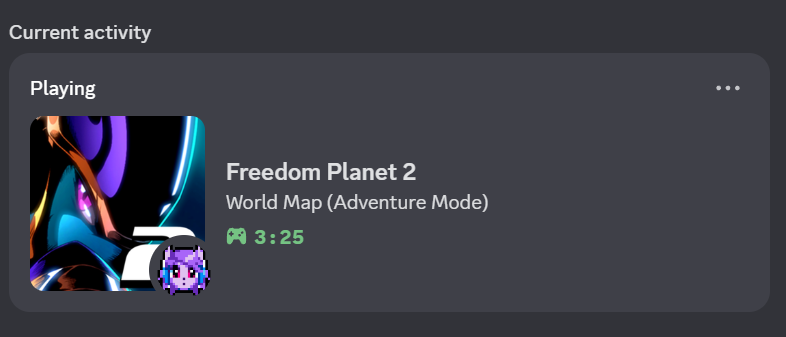
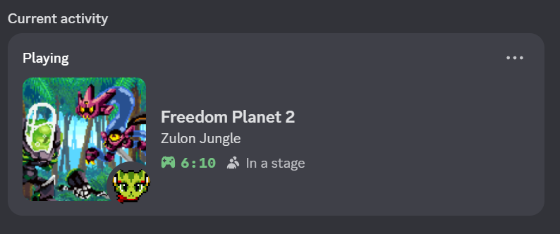
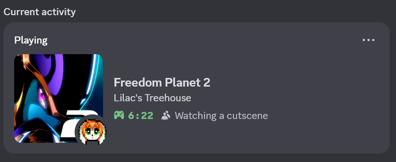
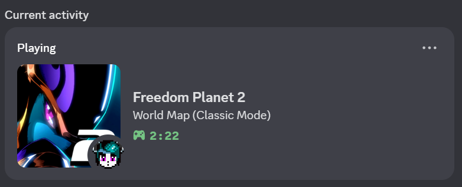
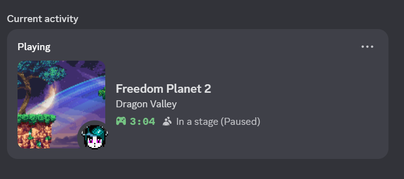
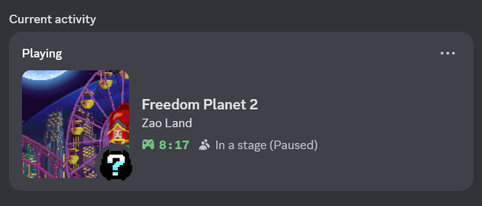
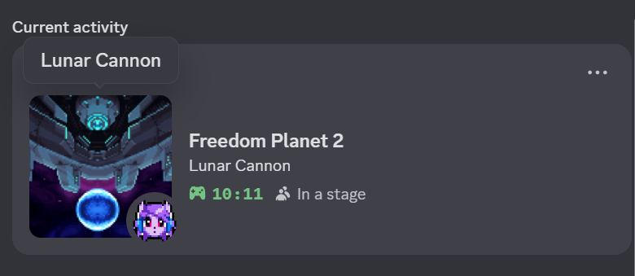
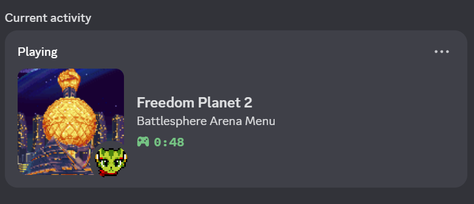

# FP2DiscordRPC

A mod for Freedom Planet 2 that implements Discord Rich Presence support.
## Features
While playing the game, the following details will be displayed on your profile:

- Which character you are playing as and their appropriate icon (This even accounts for custom characters with the help of FP2Lib, though there will be a placeholder icon in said cases)
- What stage/hub you're in and it's appropriate stage icon
- If you are currently watching a cutscene
- The current menu you are in (i.e the world map in both Adventure and Classic Mode, the main menu, etc.)

## Screenshots
<table>
  <tr>
    <td>

</td>
    <td>

</td>
  </tr>
  <tr>
    <td>

</td>
    <td>

</td>
  </tr>
  <tr>
    <td>

</td>
    <td>

</td>
  </tr>
  <tr>
    <td>

</td>
    <td>

</td>
    <td></td>
  </tr>
</table>

## Credits

- [Kuboroos](https://github.com/Kuborros) - Creating [FP2Lib](https://github.com/Kuborros/FP2Lib) which I used for obtaining a custom character's name for ones built using said framework.
- [koenjicode](https://github.com/koenjicode) - Creating [DiscordRush](https://github.com/koenjicode/DiscordRush) which was a great reference for how to do something like this for a Unity game as someone who learned C# through this project.

## Known Bugs
- Restarting or launching Discord while the game is running will cause the plugin to stop working. You'll have to launch the game with Discord running in order for the plugin to work; I'm currently working on trying to sort out a fix for this issue.

## Building

Requirements:
- A copy of [Visual Studio 2022](https://visualstudio.microsoft.com/) with the .NET Framework 3.5 development tools installed
- The PC version of Freedom Planet 2 setup for modding with [Freedom Manager](https://gamebanana.com/tools/10870)
- A copy of the Discord Game SDK 32-bit DLL (NOT the 64-bit one) from [here](https://discord.com/developers/docs/developer-tools/game-sdk)

After meeting the requirements, add references to the `Assembly-CSharp.dll`, `UnityEngine.dll` and `FP2Lib.dll` assemblies, the former 2 of which can be found in `<FP2GameRoot>/FP2_Data/Managed` while the latter can be found in `<FP2GameRoot>/plugins/lib`.
Once you add the references, you should be able to build the solution from there.
